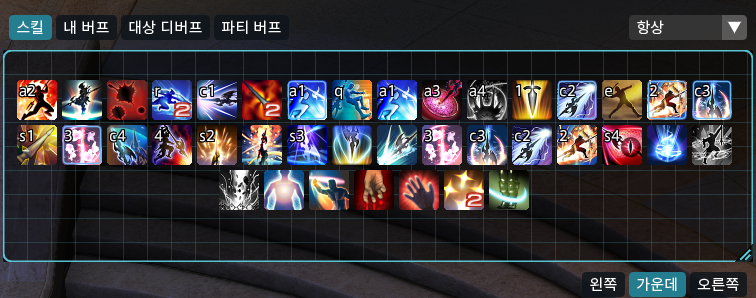
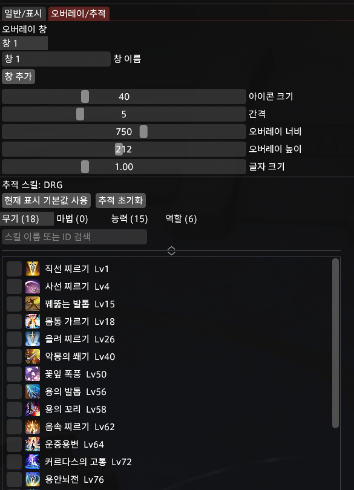

# FFXIVAura

FFXIVAura is a Dalamud-native cooldown and aura tracking overlay for Final Fantasy XIV. It started as a replacement for an ACT/HTML WeakAura-style overlay and is currently focused on the Korean FFXIV client environment.

The goal is simple: show only the skills, buffs, debuffs, charges, cooldowns, and proc states you actually care about, in movable icon windows that can behave like a lightweight WeakAura setup.

> Status: early custom plugin. It is usable for personal testing, but the data model and UI are still evolving.

## Features

- Dalamud-native ImGui overlay, no ACT browser overlay required.
- `/fa` command opens the settings window.
- Multiple overlay windows.
- Per-window options for size, gap, font scale, position, role, and display condition.
- Overlay edit controls for window role, display condition, window name, alignment, resize, and safe skill removal.
- Overlay roles:
  - Skill cooldowns
  - Player buffs
  - Target debuffs
  - Party buffs
  - Party defensives
  - Party healing cooldowns
  - Party damage synergies
- Per-job tracked skill lists.
- Per-job icon positions.
- Manual icon dragging inside the overlay grid.
- Drag resize handle for overlay width and height.
- Row-based display order editor.
- Per-window left, center, and right icon alignment.
- Effective level filtering for synced content, with transient compact placement that preserves the saved full-level layout.
- Role action support is always enabled.
- Cooldown display using Dalamud ActionManager data.
- Charge count display for charge-based skills.
- Adjusted action display through game action adjustment data.
- Unavailable/proc-gated action desaturation.
- Ready and adjusted-action highlight options.
- Keybind label display for tracked hotbar actions.
- Overlay-top action tooltips with game-evaluated localized Lumina details, including embedded potency, duration, transformed-action, and charge text.
- Hide overlay during zone load.
- Optional display conditions:
  - Always
  - In combat
  - Out of combat
  - Cooling/active only
  - Ready/missing only
- Aura search and tracking for recently seen buffs/debuffs.
- Aura search by status name, status ID, action name, or action ID, with result tags for active, recently seen, action-granted skill names, status-list, and same-name status IDs.
- Party aura options for own-only filtering and party member count display. Effects applied by the local player's owned summon are treated as the player's own effects.
- Party cooldown boards show each party member in the in-game party-list order with job icon, short name, ready skills, active borders, and estimated cooldown timers after active effects end. Alliance boards use vertically stacked A/B/C sections with up to eight members in each party.
- Wrapped cooldown rows keep a tight gap within one member and a wider gap before the next member; the job icon and name stay aligned with that member's first icon line.
- Party defensive, healing cooldown, and damage synergy boards are separated so healer cooldowns do not crowd the defensive board.
- Party cooldown presets show all configured job skills by default, and each window can exclude unneeded preset entries from settings.
- Party cooldown replacement groups hide lower-level actions after the current effective level unlocks their upgraded action.
- Optional detailed performance profiling with section and per-window timings.
- Optional automatic CSV performance recording for development builds.

## Screenshots

### Overlay Edit Mode



### Overlay / Tracking Settings



## Configuration Overview

Open the settings window with `/fa`.

### General / Display

- Enable or disable the plugin.
- Lock overlay movement.
- Hide overlays during zone loading.
- Show or hide action and aura tooltips above FFXIVAura windows.
- Check current job, effective level, loaded action count, and command name.
- Highlight ready actions.
- Highlight adjusted/transformed actions.
- Show keybind text for skill cooldown windows.
- Show missing auras for aura windows.
- Show own-only party auras and party aura count labels.

### Overlay / Tracking

- Add or delete icon windows.
- Add a clean default window or clone the current window.
- Change icon size, gap, overlay width, overlay height, and font scale.
- Select tracked skills by job.
- Filter skills by category:
  - Weapon skills
  - Spells
  - Abilities
  - Role actions
- Search skills by name or ID.
- Edit row-based display order.
- Resize the tracked order editor area by dragging the divider.
- Search and add recently seen buffs/debuffs.
- Aura search results show where a status came from, including active, recent, action-granted skill names, full status list, and same-name ID hints. Action-granted statuses keep their skill source tag even when found by status name or status ID.
- Buff/debuff windows set to the Active display condition continuously compact the currently active auras so expired or newly appeared statuses do not leave empty slots.
- Party defensive, party healing cooldown, and party damage synergy windows use built-in job data instead of manual tracking lists. Skills above the current effective level are hidden for synced content.
- Party cooldown boards read the current party roster and use the game's cross-realm alliance UI data for the authoritative A/B/C group and member order. Party/flat alliance slots remain a compatibility fallback while that data is loading.
- Alliance boards stack A, B, and C vertically with up to eight member rows per group. If the full board would exceed the overlay height limit, rendering temporarily compacts icon size, spacing, and labels without changing the saved window settings.
- Multi-charge party cooldowns are estimated per charge. A skill remains usable while at least one charge is available, and its current charge count is shown on the icon.
- Combat-log and active-status observations for the same charge use are merged even when they arrive out of order.
- A short, identity-scoped last-good status snapshot prevents transient Dalamud status-list read failures from making aura and party-cooldown icons flicker.
- Active party-cooldown timers prefer the caster's native party-list status, then another party-list recipient, and use object-table status data only as a fallback.
- Coarse party-list status updates are interpolated from a stable end time, so active timers decrease continuously without extending or shortening on noisy intermediate samples. Only a confirmed use or near-full-duration reapplication resets the end time.
- In party cooldown windows, uncheck preset entries in the settings list to exclude skills you do not want that window to track.

The most common per-window controls are available directly on the unlocked overlay:

- Top-left buttons switch the window role.
- Top-right display condition combo changes when the window is shown.
- Bottom-left name field renames the window.
- Bottom-right buttons change icon alignment.
- The lower-right corner handle resizes the overlay box.
- Ctrl + right-click on a skill icon removes it from that overlay while edit controls are visible.

Each window stores its own display settings and manual icon positions. When a window is switched between skill and aura roles, the last display condition used for that role is restored. Buff/debuff windows use automatic compact placement only while their display condition is Active. Skill windows also compact temporarily when synced-level filtering hides saved skills, but the full-level saved positions are not rewritten.

### Performance Profiling

The general settings include a detailed profiling option for local debugging. When enabled, the performance overlay shows:

- Total plugin frame time, per-frame managed allocation, and Gen0 collection count.
- Section timings for overlay rendering, frame model creation, positioning, cooldowns, icon rendering, aura scans, keybind rebuilds, tooltip rendering, and grayscale processing.
- Current, average, maximum, recent 5-second average, and maximum timestamp values. The recent average keeps a larger bounded sample window so high-FPS clients do not shorten the displayed 5-second view too aggressively.
- Per-window timings by overlay window name.

Use this only while diagnosing performance. Keep it disabled for normal play unless you are actively checking a problem.

For longer development sessions, enable `프로파일 자동 기록` in the general settings. The plugin writes `performance-profile.csv` to the Dalamud plugin config directory once per configured interval. File writes and configuration saves run through bounded background queues so disk latency does not stall overlay rendering; plugin unload drains queued saves and persists the latest pending snapshot last. Queue depth, dropped work, completion/failure counts, and write duration are included in diagnostics. Rows are stored in long format with `frame`, `section`, `window`, and `diagnostic` scopes, so the same file can be filtered by total frame time, profiler section, overlay window, runtime state, frame allocation, or Gen0 activity. Diagnostic rows include player level/combat/loading state, overlay/window settings, cache sizes, status fallback and owned-object source counts, aura cache state, party cooldown log/runtime counts, party status-scan/cache-hit counts, grayscale queue state, tooltip activity, per-window display decision counts, and the last notable debug event. When the file reaches the configured size limit, the previous file is rotated to `performance-profile.previous.csv`.

When automatic recording is enabled, party cooldown log observations are kept even if the on-screen log observer is hidden. Tracked actions and actionable errors use a separate bounded history from ordinary unrecognized action samples, so normal combat traffic cannot evict the records needed for debugging. Tooltip hover/render counts, temporary skill layout count, and cross-realm alliance group diagnostics are recorded so these runtime fixes can be verified in game.

## Data Files

### `Data/abilities.json`

This is the main skill metadata file used by the overlay. It contains job, level, action ID, icon ID, display name, category, and charge/cooldown-related metadata used by the plugin.

When a game patch changes actions, this file is the first place to check.

### `Data/party_cooldowns.json`

This file defines the built-in party defensive, healer cooldown, and damage synergy board entries. Each entry maps a job or role action to an action ID, category, expected active duration, and any known active status IDs. Runtime status detection is source-aware, so party cooldowns are attributed to the party member who applied the status. Party and alliance rosters are sampled from Dalamud party APIs each frame before display. Entries are shown by default; user exclusions are stored per overlay window.

Party cooldowns are intentionally data-driven instead of fully automatic. Dalamud `ActionManager` can resolve adjusted actions and cooldowns for the local player, but it cannot directly read another party member's personal cooldown state. The party boards therefore use curated action data, combat log observations, active status IDs, and cooldown estimation.

Use `replacementGroup` for level-based upgrades that should occupy the same board slot. For example, Physis and Physis II share a replacement group, so synced content shows Physis before level 60 and Physis II at level 60 or above. These groups are checked by tests against verified `ReplaceAction.csv` / `Trait.csv` rows from the Korean datamining snapshot, so newly added groups should be backed by the same kind of source data.

When this file changes, verify:

1. The action exists in `abilities.json`.
2. The job or role action mapping is correct.
3. The unlock level matches synced-content behavior.
4. The active duration is close enough for cooldown estimation.
5. Duration-based entries include the status IDs needed for active-border detection.
6. Upgraded actions are grouped with `replacementGroup` only when backed by verified replacement data.
7. In game, the active border appears on the user who cast the skill.
8. In alliance content, roster count and source diagnostics in `performance-profile.csv` match the actual 24-player roster.
9. Alliance row labels match the in-game A/B/C party grouping.

Typical update workflow:

1. Compare the new Korean client action data against the current `abilities.json`.
2. Update changed action IDs, icon IDs, levels, names, categories, and charge data.
3. Check transformed or upgraded actions for affected jobs.
4. Build the plugin.
5. Test in game with the affected jobs and synced level content.

## Code Map

- `Plugin.cs`
  - Plugin entry point, Dalamud services, command registration, and lifecycle.
- `Abilities/`
  - Ability data, adjusted actions, cooldown calculations, tracked-skill editing, rendering, and keybind indexing.
- `Auras/`
  - Player/target/party aura snapshots, search, tracking, positioning, and rendering.
- `Configuration/`
  - Settings UI, window management, config migration/normalization, deep snapshots, and background saves.
- `Core/`
  - Job metadata, status snapshots, data-file loading, runtime keys, login stabilization, and keybind formatting.
- `Overlay/`
  - Overlay frame models, edit controls, layout geometry, icon positions, resizing, and shared icon rendering.
- `PartyCooldowns/`
  - Party/alliance roster snapshots, curated definitions, charge-aware runtime tracking, combat-log matching, active-status attribution, board layout, and rendering.
- `Performance/`
  - Frame/section profiling, diagnostic CSV formatting, bounded background recording, and profiler UI.
- `Tooltips/`
  - Overlay-top action and aura tooltip rendering, hover resolution, positioning, and diagnostics.
- `tests/FFXIVAura.Tests/`
  - Pure-logic and regression tests grouped by the same feature boundaries.

## Verification

The project targets .NET 10 and Dalamud API 15 through `Dalamud.NET.Sdk`. Set `DALAMUD_HOME` to a directory containing the Dalamud development assemblies. The local Korean launcher API 15 path is used as a fallback when it exists.

```powershell
$env:DALAMUD_HOME = 'C:\path\to\dalamud'
dotnet restore .\FFXIVAura.csproj --locked-mode
dotnet restore .\tests\FFXIVAura.Tests\FFXIVAura.Tests.csproj
dotnet build -c Release --no-restore
dotnet run --project .\tests\FFXIVAura.Tests\FFXIVAura.Tests.csproj -c Release --no-restore
```

Release builds generate `bin/Release/FFXIVAura/latest.zip`. GitHub Actions repeats the locked restore, warning-as-error test/build run, release build, and package upload on pushes and pull requests. Runs for the same branch are serialized by cancellation, and deployment refuses to replace a newer repository version with an older one.

The test suite validates party cooldown data shape, status ID coverage for duration-based entries, synced-level replacement selection, and the currently curated `replacementGroup` mappings.

Before treating a build as stable, also run through [the manual validation checklist](docs/manual-validation.md), especially after changes to overlay positioning, level sync behavior, tooltips, aura search, or profiling.

## Patch Notes for Maintainers

When FFXIV updates actions, check these areas:

- New jobs or removed jobs.
- Action ID changes.
- Icon ID changes.
- Skill name changes in the Korean client.
- Level unlock changes.
- Charge count changes by level.
- Role action availability.
- Skills that upgrade automatically by level.
- Skills that transform through `GetAdjustedActionId`.
- Skills that are only usable with a proc, gauge, stance, or temporary state.
- Party cooldown status IDs and level-based replacement groups.

For new jobs, add or verify:

- Job abbreviation.
- Job role.
- All trackable actions in `abilities.json`.
- Role actions.
- Charge skills.
- Upgraded actions.
- Adjusted/transformed actions.
- Party defensive, healing cooldown, and damage synergy preset entries.
- Keybind and cooldown behavior in game.

## Known Limitations

- Korean action names depend on curated local action data.
- Some job-specific gauge/proc states may still need explicit modeling.
- Aura search is based on currently or recently observed statuses, not a full clean localized status database.
- Alliance party cooldown tracking depends on Dalamud alliance roster/status data and should be manually verified in live 24-player content after game or Dalamud updates.
- UI text is mainly Korean.

## Repository Policy

This repository contains a personal custom plugin for experimentation and Korean client use. Contributions and ideas are welcome, but behavior should be tested in game before being treated as stable.

Please do not use this plugin to automate gameplay or bypass game rules. FFXIVAura is intended only as a visual tracking overlay.

## License

FFXIVAura is released under the MIT License. See [LICENSE](LICENSE).
